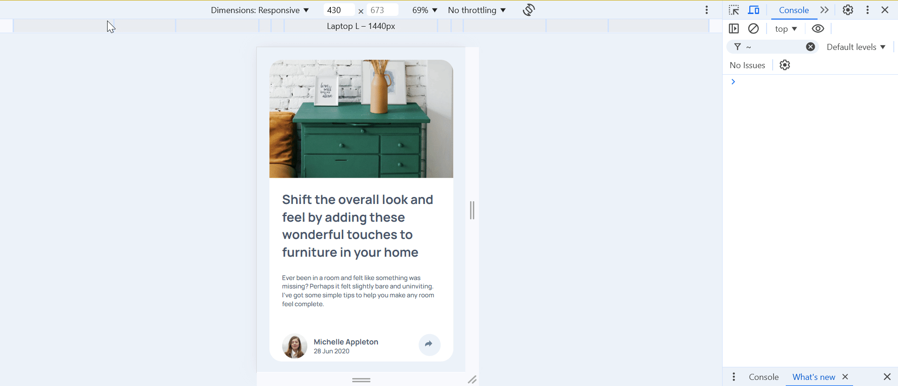

# Frontend Mentor - Article preview component solution

This is a solution to the [Article preview component challenge on Frontend Mentor](https://www.frontendmentor.io/challenges/article-preview-component-dYBN_pYFT).

## Table of contents

- [Overview](#overview)
  - [The challenge](#the-challenge)
  - [Screenshot](#screenshot)
  - [Links](#links)
- [My process](#my-process)
  - [Built with](#built-with)
  - [What I learned](#what-i-learned)
  - [Continued development](#continued-development)
  - [Useful resources](#useful-resources)
- [Author](#author)

## Overview

### The challenge

Users should be able to:

- View the optimal layout for the component depending on their device's screen size
- See the social media share links when they click the share icon

### Screenshot



### Links

- Solution URL: [Github link](https://github.com/snigdha-sukun/article-preview-component)
- Live Site URL: [Article Preview](https://article-preview-component-eight.vercel.app/)

## My process

### Built with

- Semantic HTML5 markup
- CSS custom properties
- Flexbox
- CSS Grid
- Mobile-first workflow
- Vanilla Javascript

### What I learned

I learned about webkit options in CSS:
```css
width: -webkit-fill-available;
```

I learned that we can put svg inside the html itself and manipulate the colors as we need:
```html
<svg xmlns="http://www.w3.org/2000/svg" width="15" height="13" class="share_icon" id="share-icon">
  <path fill="hsl(214, 17%, 51%)" id="share_icon_path" d="M15 6.495L8.766.014V3.88H7.441C3.33 3.88 0 7.039 0 10.936v2.049l.589-.612C2.59 10.294 5.422 9.11 8.39 9.11h.375v3.867L15 6.495z" />
</svg>
```

I learned how to create reponsive tooltip using CSS:

```html
<div id="share-button" class="tooltip">
  <div class="social-media" id="social-media-options">
    S H A R E
    
    
    
  </div>
  <svg xmlns="http://www.w3.org/2000/svg" width="15" height="13" class="share_icon">
    <path class="share_icon_path" fill="#6E8098" d="M15 6.495L8.766.014V3.88H7.441C3.33 3.88 0 7.039 0 10.936v2.049l.589-.612C2.59 10.294 5.422 9.11 8.39 9.11h.375v3.867L15 6.495z" />
  </svg>
</div>
```

```css
.tooltip {
        position: relative;
    }

    .social-media {
    display: none;
    justify-content: space-between;
    align-items: center;
    position: absolute;
    z-index: 1;
    transform: translateX(-50%);
    top: -130%;
    left: 50%;
}

    .social-media::after {
        content: "";
        position: absolute;
        top: 100%;
        left: 50%;
        margin-left: -5px;
        border-width: 5px;
        border-style: solid;
        border-color: var(--very-dark-grayish-blue) transparent transparent transparent;
}
```

```js
const shareOptions = document.getElementById('social-media-options');
shareOptions.style.display = 'flex'
```

I learned how to use media query in js for different size screens
```js
const mediaQuery = window.matchMedia("(max-width: 768px)");
```

I also learned that its better to use `class` to style CSS and `id` to get elements quickly in JS.

### Continued development

I still need to practice the positioning an element & `@media`. I need to practice using JS for making the UI to react to different events. I also need to learn about responsive CSS, HTML5 rules & JS.

### Useful resources

- [Responsice Tooltip](https://www.youtube.com/watch?v=IEywhi4w5Ts) - This helped me in creating the required tooltip. It helped me make the tooltip responsive.

## Author

- Frontend Mentor - [@snigdha-sukun](https://www.frontendmentor.io/profile/snigdha-sukun)
